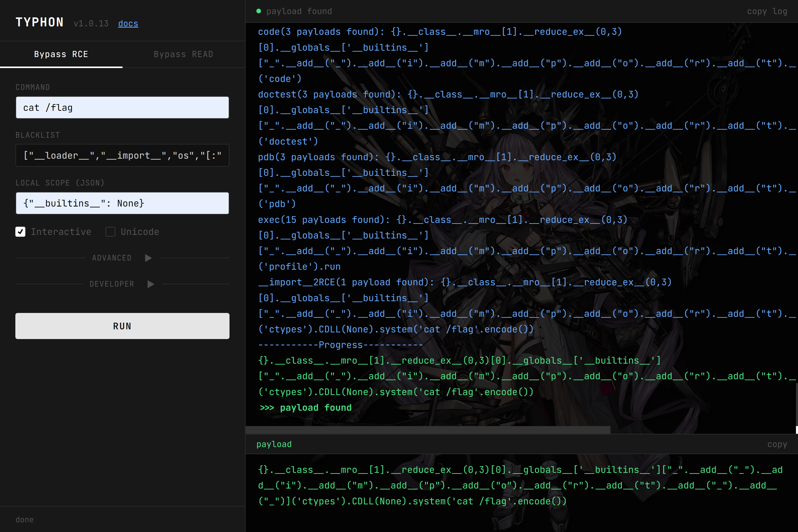
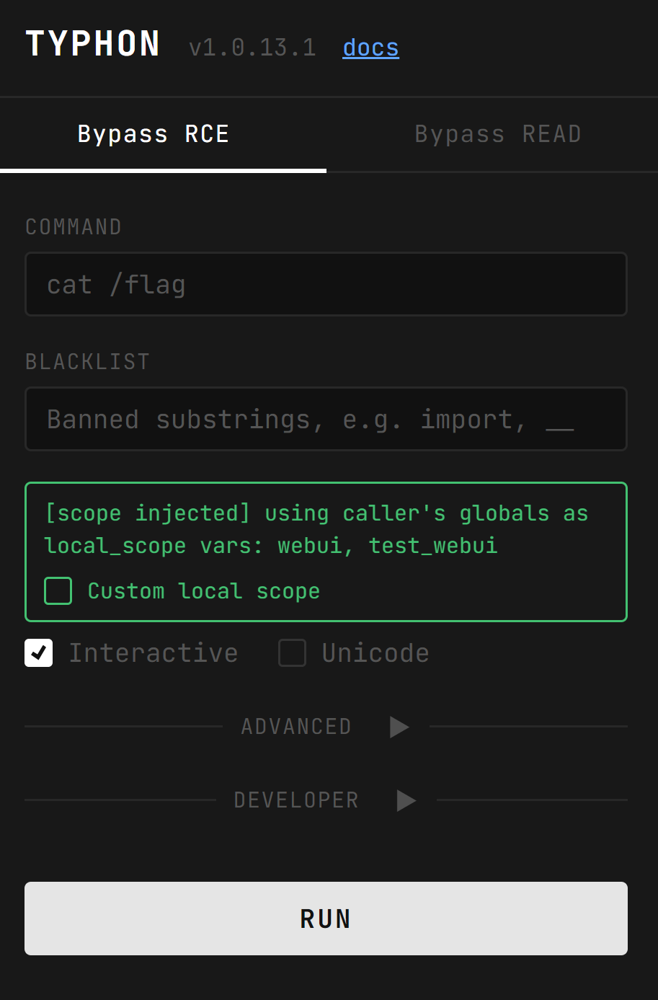

# Typhon: Let's solve pyjail without brain  

[](https://piptrends.com/package/typhonbreaker)


[](https://codecov.io/gh/LamentXU123/Typhon)

[中文](./README.md), [English](./README_EN.md), [日本語](./README_JA.md)

Listen, I'm fed up with those stupid CTF pyjail challenges — every time I waste time searching through long blacklists and various pyjail summaries to find which chains aren't filtered, or running `dir()` one by one in the namespace to find usable stuff. It's simply torture.

So this is Typhon, a one-click tool dedicated to letting you solve pyjail without using your brain.


> [!IMPORTANT]
>
> **To avoid unnecessary time waste, please read the documentation carefully before use: https://typhon.lamentxu.top/**

- [Highlights](#Highlights)  
- [How to Use](#How-to-Use)  
- [Q&A](#QA)
- [Proof of Concept](#Proof-of-Concept)  
- [Limitations](#Limitations)  
- [Milestones](#Milestones)  
- [Contributing](#Contributing)  
- [Credits](#Credits)  
- [License](#License)  
- [Misc](#Misc)

## Highlights

- Completely open source, free one-click tool  
- No need to use your brain to complete pyjail challenges, protecting your brain cells and eyes
- Has hundreds of gadgets and almost all mainstream bypass methods
- Supports multiple functions for different purposes, such as `bypassRCE()` for RCE, `bypassRead()` for file reading, etc.
- No third-party library dependencies (including CLI/WebUI, all implemented with standard libraries)

## How to Use

### Install

You can install it using pip:

```
pip install TyphonBreaker
```

### Step by Step Tutorial

You can learn Typhon's practical usage through the examples in the [example documentation](https://typhon.lamentxu.top/zh-cn/latest/EXAMPLE.html). The following is just an example.

Suppose we have the following challenge:

```python
import re
def safe_run(cmd):
    if len(cmd) > 160:
        return "Command too long"
    if any([i for i in ['import', '__builtins__', '{}'] if i in cmd]):
        return "WAF!"
    if re.match(r'.*import.*', cmd):
        return "WAF!"
    exec(cmd, {'__builtins__': {}})

safe_run(input("Enter command: "))
```

**Step1. Analyze the WAF**

First, we need to analyze the pyjail WAF functionality (this might be the only part that requires using your brain).

It can be seen that the WAF for the above challenge is as follows:

- Maximum length limit of 160
- No `__builtins__` in the exec namespace
- Forbidden to use `builtins`, `import`, `{}` characters
- Set with the regular expression `'.*import.*'` restriction

**Step2. Import WAF into Typhon**

First, we delete the exec line:

```python
import re
def safe_run(cmd):
    if len(cmd) > 160:
        return "Command too long"
    if any([i for i in ['import', '__builtins__', '{}'] if i in cmd]):
        return "WAF!"
    if re.match(r'.*import.*', cmd):
        return "WAF!"

safe_run(input("Enter command: "))
```

Then, we replace the exec line with Typhon's corresponding bypass function, import WAF at the corresponding position, **and add `import Typhon` above that line**:

```python
import re
def safe_run(cmd):
    import Typhon
    Typhon.bypassRCE(cmd,
    banned_chr=['__builtins__', 'import', '{}'],
    banned_re='.*import.*',
    local_scope={'__builtins__': {}},
    max_length=160)

safe_run(input("Enter command: "))
```

**Step3. Run**

Run your challenge program and wait for the **Jail broken** message to appear.


### WebUI



**Method 1: Command line startup**

```
typhonbreaker webui
```

Open in browser: `http://127.0.0.1:6240`

> Note: The current WebUI listens on `127.0.0.1:6240`. If running on a server, please pay attention to access control/firewall configuration.

**Method 2: Python API startup (can inject current variable space)**

Directly call `Typhon.webui(use_current_scope=True)` in the challenge script to start the WebUI,
and automatically inject the current `__main__` global variable space as local_scope — the effect is equivalent to inline `import Typhon` followed by `Typhon.bypassRCE/bypassREAD`, but can be operated through the browser UI. This allows you to fill in custom variables from the challenge's namespace.

```python
import re

def safe_run(cmd):
    if re.match(r'.*import.*', cmd):
        return "WAF!"
    import Typhon
    Typhon.webui(use_current_scope=True) # Similar to bypassRCE/bypassREAD
```

After startup, leave the "Local Scope" field blank in the WebUI to automatically use the injected variable space, and a green banner will appear above the input box.
If the challenge's `exec` uses a restricted namespace (such as `{'__builtins__': {}}`), it still needs to be manually filled in the UI.



### Docker WebUI

This repository contains a `Dockerfile` for building the WebUI image, and provides GitHub Actions to automatically publish to GHCR.

1) Pull and run:

```
docker run --rm -p 6240:6240 ghcr.io/lamentxu123/typhonbreaker-webui:latest
```

2) Or use compose:

```
docker compose up --build
```

Custom host port (still 6240 inside the container):

```
TYPHONBREAKER_PORT=7000 docker compose up --build
```

## Q&A

- When to `import Typhon`?

You must place the line `import Typhon` on the line immediately above Typhon's built-in bypass function (even if you have PEP-8 OCD). Otherwise, `Typhon` will not be able to obtain the current global variable space through the stack frame.

**Do:**
```python
def safe_run(cmd):
    import Typhon
    Typhon.bypassRCE(cmd,
    banned_chr=['builtins', 'os', 'exec', 'import'])

safe_run('cat /f*')
```

**Don't:**
```python
import Typhon

def safe_run(cmd):
    Typhon.bypassRCE(cmd,
    banned_chr=['builtins', 'os', 'exec', 'import'])

safe_run('cat /f*')
```

- Why do I need to use the same Python version as the challenge?

There are some gadgets in Pyjail that find corresponding objects through indexes (such as inheritance chains). The utilization of inheritance chains varies greatly with indexes. Therefore, please make sure that Typhon's runtime environment is the same as the challenge.

**Can't guarantee?**

Yes, most challenges won't provide the corresponding Python version. Therefore, **Typhon will give a warning when using version-related gadgets**.  


In this case, CTF players often need to find the index values required by the gadgets in the challenge environment themselves.  

- What if the challenge's `exec` and `eval` don't restrict the namespace?

If the challenge doesn't restrict the namespace, you don't need to fill in the `local_scope` parameter. Typhon will automatically use the current namespace at the time of `import Typhon` for bypass

- What if this payload doesn't work for me, can I get another one?

You can add `print_all_payload=True` to the parameters, and Typhon will print all the payloads it generates.

- This web challenge doesn't seem to open stdin, what should I do if `exec(input())` doesn't work?

You can add `interactive=False` to the parameters, and Typhon will prohibit the use of all payloads involving `stdin`.

- What if the final output payload has no echo?

For `bypassRCE`, we believe: **As long as the command is executed, RCE is successful.** As for the echo issue, you can choose to reverse shell, time-based blind injection, or: add the `print_all_payload=True` parameter to view all payloads, which may include payloads that can successfully echo.

## Proof of Concept

Typhon works as follows:

### bypass by path & technique

We define two bypass methods:

- path: Bypass through different payloads (e.g., `os.system('calc')` and `subprocess.Popen('calc')`)  
- technique: Process the same payload using different techniques to bypass (e.g., `os.system('c'+'a'+'l'+'c')` and `os.system('clac'[::-1])`)  

Typhon has built-in hundreds of paths. Every time we need to bypass to get something, we first find all available `path` through local_scope, then generate different variants for each `path` through `technique` in `bypasser.py`, and try to bypass the blacklist.

### gadgets chain

This idea is inspired by the [pyjailbreaker](https://github.com/jailctf/pyjailbreaker) tool.

pyjailbreaker doesn't directly implement RCE through gadgets in one step, but looks for the items needed in the RCE chain step by step. For example, assuming the following blacklist:

- No `__builtins__` in local namespace
- Forbidden to use `builtins` character

For this WAF, Typhon handles it like this:

- First, we get `type` through `'J'.__class__.__class__`
- Then, we find the RCE chain that can get builtins after getting type: `TYPE.__subclasses__(TYPE)[0].register.__globals__['__builtins__']`
- Knowing that the challenge blacklist filters the `__builtins__` character, we put this path into the bypasser to generate dozens of variants. Choose the shortest variant: `TYPE.__subclasses__(TYPE)[0].register.__globals__['__snitliub__'[::-1]]`
- Then, we find the RCE chain after getting ``__builtins__``: `BUILTINS_SET['breakpoint']()`
- Finally, we replace the placeholder `BUILTINS_SET` representing the builtins dictionary with the `__builtins__` path obtained in the previous step, and so on, replace the `TYPE` placeholder with the real path, and we get the final payload.

```python
'J'.__class__.__class__.__subclasses__('J'.__class__.__class__)[0].register.__globals__['__snitliub__'[::-1]]['breakpoint']()
```

### Step by Step

Typhon's workflow sequence is as follows:

- Each endpoint function (`bypassRCE`, `bypassREAD`, etc.) will call the main function `bypassMAIN`, which will collect as many available gadgets as possible (such as `type` in the above example) and pass the collected content to the corresponding subordinate functions.
- After a simple analysis of the current variable space, the `bypassMAIN` function will:
  - Try direct RCE (such as `help()`, `breakporint()`)
  - Try to get generator
  - Try to get type
  - Try to get object
  - Try to get bytes
  - If ``__builtins__`` in the current space is not deleted but modified, try to restore it (such as `id.__self__`)
  - If ``__builtins__`` in the current space is deleted, try to restore it from other namespaces
  - Continue, try inheritance chain bypass
  - Try to get the ability to import packages
  - Try direct RCE through possibly restored ``__builtins__``
  - Pass the result to subordinate functions
- After the subordinate function gets the result of `bypassMAIN`, it will select the corresponding gadgets for processing according to the requirements implemented by the function (such as `bypassRCE` focusing on RCE, `bypassREAD` focusing on file reading, `bypassENV` focusing on reading environment variables). The process is similar to the above.

For the specific implementation process, see the blog: https://www.cnblogs.com/LAMENTXU/articles/19101758

## Limitations

- Currently, Typhon only supports Python 3.9 and above.
- Currently, Typhon only supports Linux sandboxes.
- Currently, Typhon cannot bypass audithook sandboxes.
- Due to Typhon's locally optimal recursive strategy, it may take longer (about 1 minute) for some simple challenges.
- Currently known unsupported bypass methods:

  - Typhon does not support using `list.pop(0)` instead of `list[0]`, because all payloads generated by Typhon need to be verified through local execution to be valid, and the `pop` method will delete elements from the list during verification, thus breaking the subsequent environment.

## Milestones

### v1.0 (Released)

- [x] Implement basic framework

### v1.1

- [ ] Implement more bypassers
    - [x] Use magic methods to replace binary operators (`a.__add__(b)` instead of `a+b`)
    - [ ] `list.pop(0)` instead of `list[0]`
    - [x] `list(dict(a=1))[0]` instead of `'a'`
    - [x] `str()` instead of empty string
- [ ] Implement built-in bash bypasser 
- [x] Better `bypassREAD` function  
- [x] Implement whitelist functionality
- [x] Automatically find `bytes`

### v1.2

- [ ] Implement `audithook` sandbox bypass  
- [ ] In the absence of length restrictions, do not use locally length-optimal recursive algorithm
- [ ] Implement `bypassENV` function for reading environment variables

## Contributing

### Provide challenges that Typhon cannot solve

We will collect challenges that Typhon cannot solve for a long time. This is very important for improving tool performance! If you encounter a challenge that cannot be solved with one click, please open an issue in this repository and write the challenge source (preferably with a corresponding solution), and we will try our best to implement automatic solving for the challenge.

In return, we will include your GitHub ID in the next release version.

## Credits

**Author & Maintainer**

@ [LamentXU (Weilin Du)](https://github.com/LamentXU123)  

**Contributors**

Thanks to everyone who has contributed to this project:

<a href="https://github.com/eryajf/learn-github/graphs/contributors">
  
</a>

**Copyright**

For the built-in bypasser for bash bypass, thanks to the author of the [bashFuck](https://github.com/ProbiusOfficial/bashFuck) project @ [ProbiusOfficial](https://github.com/ProbiusOfficial), whose [License](https://github.com/ProbiusOfficial/bashFuck/blob/main/README.md) is here.

Copyright (c) 2024 ProbiusOfficial.

Downstream projects (if any) must include this.

Note: This feature has not been added in the current version. This copyright information is reserved in advance.

**Special Thanks**

@ [黄豆安全实验室](https://hdsec.cn) for giving me the necessary encouragement  
@ [pyjailbreaker](https://github.com/jailctf/pyjailbreaker) project for inspiring me  

## License

This project is released under the [Apache 2.0](https://github.com/LamentXU123/Typhon/blob/main/LICENSE) license.

Copyright (c) 2025 Weilin Du.

## Misc

### 404 StarLink Project


Typhon has joined the [404 StarLink Project](https://github.com/knownsec/404StarLink)

### Stars

[](https://starchart.cc/LamentXU123/Typhon)

## PIP trends

[](https://piptrends.com/package/typhonbreaker)